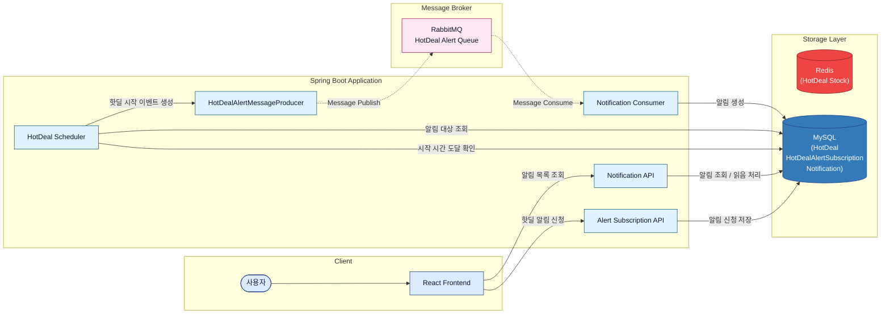

# RabbitMQ 기반 핫딜 알림 아키텍처

```mermaid
flowchart LR
%% Client
    subgraph Client["Client"]
        User([사용자])
        Frontend["React Frontend"]
        User --> Frontend
    end

%% Spring Boot
    subgraph Backend["Spring Boot Application"]
        API["Alert Subscription API"]
        Scheduler["HotDeal Scheduler"]
        Producer["HotDealAlertMessageProducer"]
        Consumer["Notification Consumer"]
        NotificationAPI["Notification API"]
    end

%% Message Broker
    subgraph Broker["Message Broker"]
        RabbitMQ["RabbitMQ<br/>HotDeal Alert Queue"]
    end

%% Storage Layer
    subgraph Storage["Storage Layer"]
        direction TB
        Redis[("Redis<br/>(HotDeal Stock)")]
        MySQL[("MySQL<br/>(HotDeal<br/>HotDealAlertSubscription<br/>Notification)")]
    end

%% 1. 알림 신청 흐름
    Frontend -->|핫딜 알림 신청| API
    API -->|알림 신청 저장| MySQL

%% 2. 핫딜 시작 알림 발행 흐름
    Scheduler -->|시작 시간 도달 확인| MySQL
    Scheduler -->|알림 대상 조회| MySQL
    Scheduler -->|핫딜 시작 이벤트 생성| Producer

    Producer -.->|Message Publish| RabbitMQ
    RabbitMQ -.->|Message Consume| Consumer

    Consumer -->|알림 생성| MySQL

%% 3. 알림 조회 흐름
    Frontend -->|알림 목록 조회| NotificationAPI
    NotificationAPI -->|알림 조회 / 읽음 처리| MySQL

%% Styling
    classDef client fill:#dbeafe,stroke:#1e3a8a,color:#0f172a,stroke-width:1px
    classDef backend fill:#e0f2fe,stroke:#075985,color:#0f172a,stroke-width:1px
    classDef broker fill:#fce7f3,stroke:#9d174d,color:#0f172a,stroke-width:1px

    classDef redis fill:#ef4444,stroke:#7f1d1d,color:#ffffff,stroke-width:1px
    classDef mysql fill:#337ab7,stroke:#1e3a8a,color:#ffffff,stroke-width:1px

    class User,Frontend client
    class API,Scheduler,Producer,Consumer,NotificationAPI backend
    class RabbitMQ broker
    class Redis redis
    class MySQL mysql
```