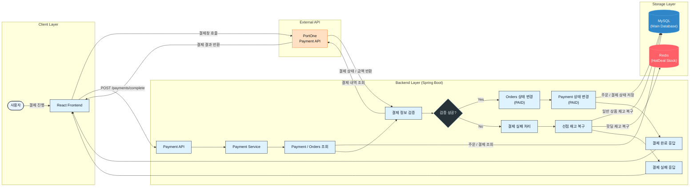

# 결제 완료 검증 흐름도

```mermaid
flowchart LR
    subgraph Client["Client Layer"]
        direction TB
        User([사용자])
        Frontend["React Frontend"]

        User -->|결제 진행| Frontend
    end

    subgraph External["External API"]
        PortOne["PortOne<br/>Payment API"]
    end

    subgraph Backend["Backend Layer (Spring Boot)"]
        direction TB
        PaymentAPI["Payment API"]
        PaymentService["Payment Service"]

        LoadPayment["Payment / Orders 조회"]
        VerifyPayment["결제 정보 검증"]
        VerifyResult{"검증 성공?"}

        ConfirmOrder["Orders 상태 변경<br/>(PAID)"]
        ConfirmPayment["Payment 상태 변경<br/>(PAID)"]

        FailPayment["결제 실패 처리"]
        RestoreStock["선점 재고 복구"]

        SuccessResponse["결제 완료 응답"]
        FailResponse["결제 실패 응답"]
    end

    subgraph Storage["Storage Layer"]
        direction TB
        Redis[("Redis<br/>(HotDeal Stock)")]
        MySQL[("MySQL<br/>(Main Database)")]
    end

    Frontend -->|결제창 호출| PortOne
    PortOne -->|결제 결과 반환| Frontend

    Frontend -->|POST /payments/complete| PaymentAPI
    PaymentAPI --> PaymentService
    PaymentService --> LoadPayment
    LoadPayment -->|주문 / 결제 조회| MySQL

    LoadPayment --> VerifyPayment
    VerifyPayment -->|결제 내역 조회| PortOne
    PortOne -->|결제 상태 / 금액 반환| VerifyPayment

    VerifyPayment --> VerifyResult

    VerifyResult -->|Yes| ConfirmOrder
    ConfirmOrder --> ConfirmPayment
    ConfirmPayment -->|주문 / 결제 상태 저장| MySQL
    ConfirmPayment --> SuccessResponse
    SuccessResponse --> Frontend

    VerifyResult -->|No| FailPayment
    FailPayment --> RestoreStock
    RestoreStock -->|일반 상품 재고 복구| MySQL
    RestoreStock -->|핫딜 재고 복구| Redis
    RestoreStock --> FailResponse
    FailResponse --> Frontend

%% 스타일링
    style User fill:#eaf4ff,stroke:#0f172a,color:#0f172a
    style Frontend fill:#dff3ff,stroke:#0f172a,color:#0f172a

    style PaymentAPI fill:#dff3ff,stroke:#0f172a,color:#0f172a
    style PaymentService fill:#dff3ff,stroke:#0f172a,color:#0f172a

    style LoadPayment fill:#dff3ff,stroke:#0f172a,color:#0f172a
    style VerifyPayment fill:#dff3ff,stroke:#0f172a,color:#0f172a
    style ConfirmOrder fill:#dff3ff,stroke:#0f172a,color:#0f172a
    style ConfirmPayment fill:#dff3ff,stroke:#0f172a,color:#0f172a
    style FailPayment fill:#dff3ff,stroke:#0f172a,color:#0f172a
    style RestoreStock fill:#dff3ff,stroke:#0f172a,color:#0f172a
    style SuccessResponse fill:#dff3ff,stroke:#0f172a,color:#0f172a
    style FailResponse fill:#dff3ff,stroke:#0f172a,color:#0f172a

    style VerifyResult fill:#263238,stroke:#9ddcff,color:#f1f5f9

    style Redis fill:#ff5f66,stroke:#ff8a8f,color:#fff
    style MySQL fill:#2f86c9,stroke:#5dade2,color:#fff
    style PortOne fill:#ffe0c2,stroke:#f97316,color:#111
```