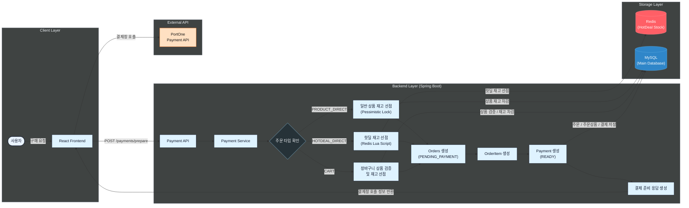

# 결제 준비 흐름도

```mermaid
flowchart LR
    subgraph Client["Client Layer"]
        direction TB
        User([사용자])
        Frontend["React Frontend"]

        User -->|구매 요청| Frontend
    end

    subgraph Backend["Backend Layer (Spring Boot)"]
        direction TB
        PaymentAPI["Payment API"]
        PaymentService["Payment Service"]
        OrderType{"주문 타입 확인"}

        ProductReserve["일반 상품 재고 선점<br/>(Pessimistic Lock)"]
        HotDealReserve["핫딜 재고 선점<br/>(Redis Lua Script)"]
        CartReserve["장바구니 상품 검증<br/>및 재고 선점"]

        CreateOrder["Orders 생성<br/>(PENDING_PAYMENT)"]
        CreateOrderItem["OrderItem 생성"]
        CreatePayment["Payment 생성<br/>(READY)"]
        PrepareResponse["결제 준비 응답 생성"]
    end

    subgraph Storage["Storage Layer"]
        direction TB
        Redis[("Redis<br/>(HotDeal Stock)")]
        MySQL[("MySQL<br/>(Main Database)")]
    end

    subgraph External["External API"]
        PortOne["PortOne<br/>Payment API"]
    end

    Frontend -->|POST /payments/prepare| PaymentAPI
    PaymentAPI --> PaymentService
    PaymentService --> OrderType

    OrderType -->|PRODUCT_DIRECT| ProductReserve
    OrderType -->|HOTDEAL_DIRECT| HotDealReserve
    OrderType -->|CART| CartReserve

    ProductReserve -->|상품 재고 차감| MySQL
    HotDealReserve -->|핫딜 재고 선점| Redis
    CartReserve -->|상품 검증 / 재고 차감| MySQL

    ProductReserve --> CreateOrder
    HotDealReserve --> CreateOrder
    CartReserve --> CreateOrder

    CreateOrder --> CreateOrderItem
    CreateOrderItem --> CreatePayment
    CreatePayment -->|주문 / 주문상품 / 결제 저장| MySQL

    CreatePayment --> PrepareResponse
    PrepareResponse -->|결제창 호출 정보 반환| Frontend
    Frontend -->|결제창 호출| PortOne

%% 스타일링
    style Client fill:#3f4342,stroke:#6b7280,color:#f1f5f9
    style Backend fill:#3f4342,stroke:#6b7280,color:#f1f5f9
    style Storage fill:#3f4342,stroke:#6b7280,color:#f1f5f9
    style External fill:#3f4342,stroke:#6b7280,color:#f1f5f9

    style User fill:#eaf4ff,stroke:#0f172a,color:#0f172a
    style Frontend fill:#dff3ff,stroke:#0f172a,color:#0f172a

    style PaymentAPI fill:#dff3ff,stroke:#0f172a,color:#0f172a
    style PaymentService fill:#dff3ff,stroke:#0f172a,color:#0f172a

    style ProductReserve fill:#dff3ff,stroke:#0f172a,color:#0f172a
    style HotDealReserve fill:#dff3ff,stroke:#0f172a,color:#0f172a
    style CartReserve fill:#dff3ff,stroke:#0f172a,color:#0f172a

    style CreateOrder fill:#dff3ff,stroke:#0f172a,color:#0f172a
    style CreateOrderItem fill:#dff3ff,stroke:#0f172a,color:#0f172a
    style CreatePayment fill:#dff3ff,stroke:#0f172a,color:#0f172a
    style PrepareResponse fill:#dff3ff,stroke:#0f172a,color:#0f172a

    style OrderType fill:#263238,stroke:#9ddcff,color:#f1f5f9

    style Redis fill:#ff5f66,stroke:#ff8a8f,color:#fff
    style MySQL fill:#2f86c9,stroke:#5dade2,color:#fff
    style PortOne fill:#ffe0c2,stroke:#f97316,color:#111
```