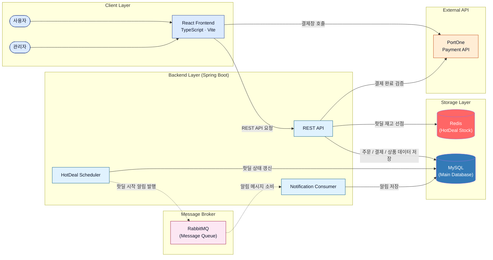

# WAT 전체 시스템 아키텍처

```mermaid
flowchart LR
%% Client Layer
    subgraph Client["Client Layer"]
        direction TB
        User([사용자])
        Admin([관리자])
        Frontend["React Frontend<br/>TypeScript · Vite"]

        User ---> Frontend
        Admin ---> Frontend
    end

%% Backend Layer
    subgraph Backend["Backend Layer (Spring Boot)"]
        direction TB
        API["REST API"]
        Scheduler["HotDeal Scheduler"]
        Consumer["Notification Consumer"]
    end

%% Message Broker
    subgraph Message["Message Broker"]
        RabbitMQ["RabbitMQ<br/>(Message Queue)"]
    end

%% Storage Layer
    subgraph Storage["Storage Layer"]
        Redis[("Redis<br/>(HotDeal Stock)")]
        MySQL[("MySQL<br/>(Main Database)")]
    end

%% External API
    subgraph External["External API"]
        PortOne["PortOne<br/>Payment API"]
    end

%% Main Flow
    Frontend -->|REST API 요청| API

    API -->|주문 / 결제 / 상품 데이터 저장| MySQL
    API -->|핫딜 재고 선점| Redis

    Frontend -->|결제창 호출| PortOne
    API -->|결제 완료 검증| PortOne

    Scheduler -->|핫딜 상태 갱신| MySQL
    Scheduler -.->|핫딜 시작 알림 발행| RabbitMQ

    RabbitMQ -.->|알림 메시지 소비| Consumer
    Consumer -->|알림 저장| MySQL

%% Styling
    classDef client fill:#dbeafe,stroke:#1e3a8a,color:#0f172a,stroke-width:1px
    classDef backend fill:#e0f2fe,stroke:#075985,color:#0f172a,stroke-width:1px

    classDef broker fill:#fce7f3,stroke:#9d174d,color:#0f172a,stroke-width:1px
    classDef external fill:#ffedd5,stroke:#c2410c,color:#0f172a,stroke-width:1px

    class User,Admin,Frontend client
    class API,Scheduler,Consumer backend
    class MySQL,Redis storage
    class RabbitMQ broker
    class PortOne external

    style Redis fill:#f66,color:#fff
    style MySQL fill:#337ab7,color:#fff
```