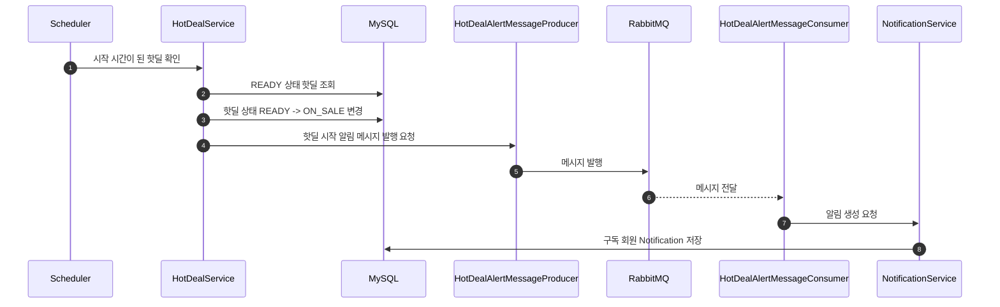

# 핫딜 시작 알림 흐름

핫딜 시작 알림은 RabbitMQ를 사용하여 핫딜 상태 변경과 알림 생성을 비동기로 분리했습니다.

```mermaid
sequenceDiagram
    autonumber
    participant Scheduler as Scheduler
    participant HotDealService as HotDealService
    participant DB as MySQL
    participant Producer as HotDealAlertMessageProducer
    participant MQ as RabbitMQ
    participant Consumer as HotDealAlertMessageConsumer
    participant NotificationService as NotificationService

    Scheduler->>HotDealService: 시작 시간이 된 핫딜 확인
    HotDealService->>DB: READY 상태 핫딜 조회
    HotDealService->>DB: 핫딜 상태 READY -> ON_SALE 변경

    HotDealService->>Producer: 핫딜 시작 알림 메시지 발행 요청
    Producer->>MQ: 메시지 발행

    MQ-->>Consumer: 메시지 전달
    Consumer->>NotificationService: 알림 생성 요청
    NotificationService->>DB: 구독 회원 Notification 저장
```