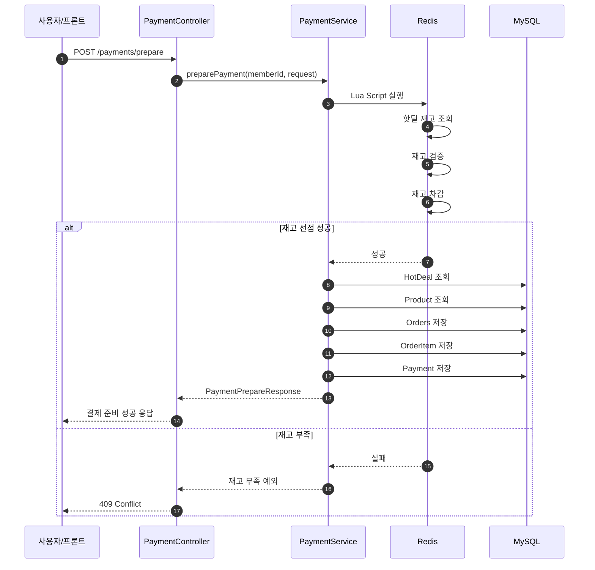

# 핫딜 상품 결제 준비 흐름

핫딜 상품 구매는 짧은 시간에 많은 요청이 몰리는 상황을 고려하여 Redis Lua Script로 재고 조회/검증/차감을 원자적으로 처리했습니다.

```mermaid
sequenceDiagram
    autonumber
    participant User as 사용자/프론트
    participant PaymentController as PaymentController
    participant PaymentService as PaymentService
    participant Redis as Redis
    participant DB as MySQL

    User->>PaymentController: POST /payments/prepare
    PaymentController->>PaymentService: preparePayment(memberId, request)

    PaymentService->>Redis: Lua Script 실행
    Redis->>Redis: 핫딜 재고 조회
    Redis->>Redis: 재고 검증
    Redis->>Redis: 재고 차감

    alt 재고 선점 성공
        Redis-->>PaymentService: 성공
        PaymentService->>DB: HotDeal 조회
        PaymentService->>DB: Product 조회
        PaymentService->>DB: Orders 저장
        PaymentService->>DB: OrderItem 저장
        PaymentService->>DB: Payment 저장
        PaymentService-->>PaymentController: PaymentPrepareResponse
        PaymentController-->>User: 결제 준비 성공 응답
    else 재고 부족
        Redis-->>PaymentService: 실패
        PaymentService-->>PaymentController: 재고 부족 예외
        PaymentController-->>User: 409 Conflict
    end
```