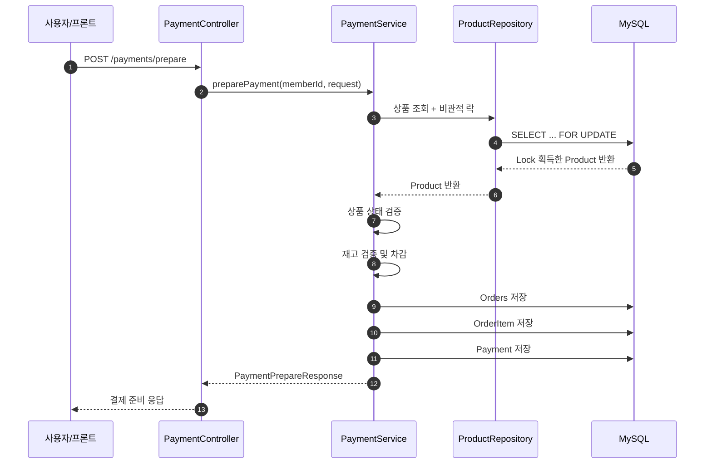

# 일반 상품 결제 준비 흐름

일반 상품 구매는 MySQL 비관적 락을 사용하여 동시에 같은 상품을 구매하더라도 재고가 초과 차감되지 않도록 처리했습니다.

```mermaid
sequenceDiagram
    autonumber
    participant User as 사용자/프론트
    participant PaymentController as PaymentController
    participant PaymentService as PaymentService
    participant ProductRepository as ProductRepository
    participant DB as MySQL

    User->>PaymentController: POST /payments/prepare
    PaymentController->>PaymentService: preparePayment(memberId, request)

    PaymentService->>ProductRepository: 상품 조회 + 비관적 락
    ProductRepository->>DB: SELECT ... FOR UPDATE
    DB-->>ProductRepository: Lock 획득한 Product 반환
    ProductRepository-->>PaymentService: Product 반환

    PaymentService->>PaymentService: 상품 상태 검증
    PaymentService->>PaymentService: 재고 검증 및 차감
    PaymentService->>DB: Orders 저장
    PaymentService->>DB: OrderItem 저장
    PaymentService->>DB: Payment 저장

    PaymentService-->>PaymentController: PaymentPrepareResponse
    PaymentController-->>User: 결제 준비 응답
```